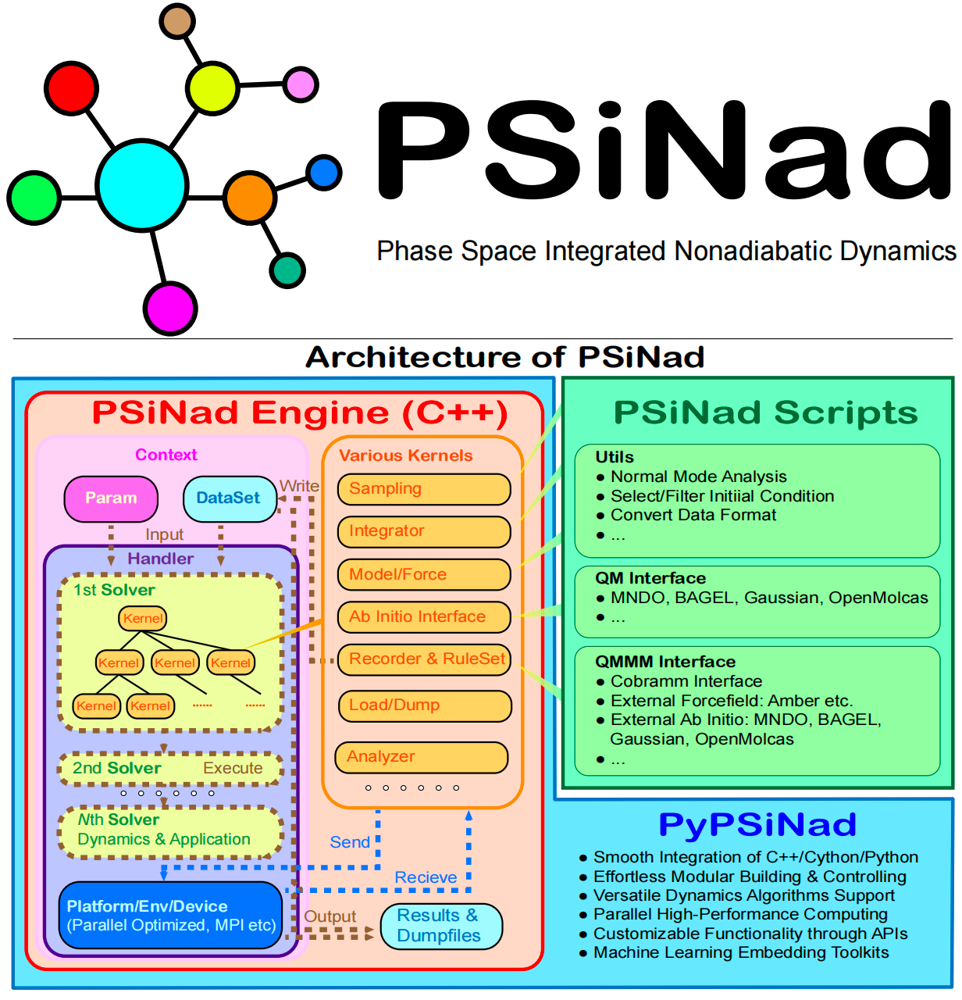

# PSiNad: Phase Space Integrated Nonadiabatic Dynamics

[TOC]

            

## Introduction

**PSiNad (Phase Space Integrated Nonadiabatic Dynamics)** is an open-source framework specifically designed for simulating chemical and physical dynamics at atomic and molecular scales in condensed matter. It excels in classical and quantum dynamics simulations, accommodating small systems, few-body systems, reduced systems, and large many-particle systems such as molecules and condensed matter. PSiNad offers a robust, versatile platform with multiple interfaces for developing advanced algorithms, ensuring ease of use and accessibility with third-party language wrappers, such as Python.

PSiNad features a comprehensive array of models and solvers, including harmonic models, forcefield models, and ab initio interfaces, meeting diverse simulation needs. It supports a wide range of computational approaches, from classical dynamics based on Newtonian and Hamiltonian mechanics to sophisticated quantum dynamics incorporating quantum phase space approximations, quantum trajectories, path integral techniques, influence functional methods, and semi-classical wavepackets.

Continual development efforts focus on expanding the library of models and solvers, with community contributions highly encouraged. To further extend its accessibility, PSiNad is now available as a Python package ([PyPSiNad](docs/api/python.md)) and a Rust crate ([rust-PSiNad](docs/api/rust.md)).

### License

Peking University @ Copyright.

The project is maintained under Jian Liu Group, CCME, PeKing University. Email <xxx@pku.edu.cn>.

~~The PSiNad framework is free of use and integration, however some algorithms may be used with proper guarantee.~~

### Support

Contributors: 

Xin He(<xshinhe@pku.edu.cn>), XXX (<xxx@pku.edu.cn>) etc.

## Features

- Utilizes high-performance and parallelized code written in modern C++ (-std=11 or later), well compiled with C-style APIs. Parallelization with MPI ([Intel OneAPI MPI](https://www.intel.cn/content/www/cn/zh/developer/tools/oneapi/toolkits.html)), OpenMP and SIMD techniques. For some functions, a GPU acceleration is also on-going and optional. Many thirdpart matrix/tensor libraries are well compiled and integrated, such as [Eigen](https://eigen.tuxfamily.org
), [Intel OneAPI MKL](https://www.intel.cn/content/www/cn/zh/developer/tools/oneapi/toolkits.html), xtensor, libtorch and python's numpy etc.
- Functions are modular and separable, all of which are intepreted as Kernel, encompassing models, solvers, and more. PSiNad offers a variety of intrinsic models for testing and exploring new dynamics approaches, such as harmonic (quadratic / quartic / Morse) PES, system-bath models (e.g. spin-boson and FMO), LCVM models, light-matter models etc. PSiNad also involves versatile solvers, including both Born-Oppenheimer Statistics & Dynamics and Non-adiabatic Statistics & Dynamics. See list of [what PSiNad does](#autotoc_md3), while for more detail documention, refer to [intrinsic models](docs/manu/models.md) and [intrinsic solvers](docs/manu/solvers.md), respectively.
- Well-organized/seperate code is potential for custom use (most are head-only), please see [how to use PSiNad code under proper LICNESE in a custom project](docs/api/libs.md). 
- A standalone dynamic library, such as `libPSiNad.xxx` (e.g. xxx=so for linux OS), is seperate with C++'s Handler and provides various useful APIs, which can be integrated into other langauges like python/rust. See [Python APIs](docs/api/python.md) and [rust APIs](docs/api/rust.md), respectively.
- It is clear and convenient for user to construct and manage the flow of the simulation. See more about the [control the flow of the simulation](docs/manu/flow.md).
- It is friendly for developer to add more advanced algorithms and organize the different versions. For integrating more models, see [how to develop models](docs/dev/dev_models.md), while for developing methods, see [how to add new solvers](docs/dev/dev_solvers.md)
- Diverse intrinsic interfaces support external force fields and ab initio calculations (as well as QM/MM). It can be interfaced to few-bodies force fields for small molecules in Fortran90 (i.e., [potlib](https://comp.chem.umn.edu/potlib)) as well as general molecular forcefield with OpenMM. Interfaces with Gaussian16 and MNDO99 for on-the-fly calculation are supported. Additionally, PSiNad allows user add custom interface to any other software only based python script, without modifying the c++ code!

## What PSiNad does

<!-- - (TO DO) MD and MD-based techniques (i.e., enhenced sampling) for classical and molecular dynamics (Whatever, THX to Sihan Wang). -->
<!-- - PIMD (techniques) for statistics for Boltzman particle, Boson/Fermion, and multi-electronic-state systems (THX to Yu Zhai). -->
<!-- - Real-time dynamics: Full semi-classical dynamics up to the HK-IVR and LCSIVR(classical Wigner). Path-integral based RPMD, CMD, and PILD-variants (Whatever, THX to Sihan Wang). -->
<!-- - Quantum dynamics built on discrete basis with a dirty realization, such as DVR, multi-configuration time-dependent Hartree (MCTDH), and tensor decomposition methods. -->
<!-- - Quantum dynamics for system-bath problem built on influence functional, including Hierarchy equation of motion (HEOM), Stochastic Schrödinger equation (SSE), Path integral techniques (QCPI). Some approximation like Redfield equation is also supported. -->
<!-- - Featured: Quantum phase space approximation, classical-wavepackets and quantum hydrodynamics (TODO). -->
- Featured: Mixed quantum-classical dynamics based on phase-space mapping methods (CMM/NaF) and its extensions. Other approximation like Ehrenfest dynamics, multiple versions of surface hopping-based method are also available.
<!-- - Further to support ab initio calculation like Hartree-Fock/DFT realization. -->

## Tested Platform

- [x] Linux (Ubuntu 20.04 LTS + Intel oneAPI) 
- [x] macOS (Sequoia + Cellar Open-mpi 5.0.6) 
- [ ] Windows (Win10 + Intel oneAPI 20)

|                        Read Next |
|---------------------------------:|
| [Installation](docs/installation.md) |

